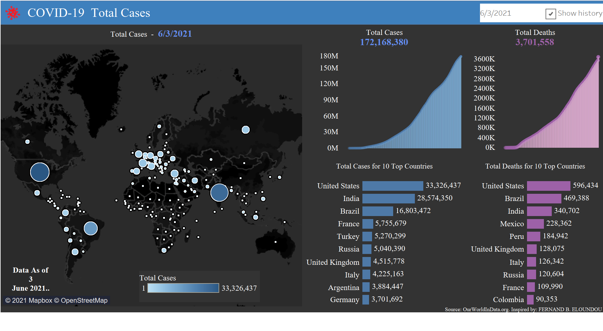
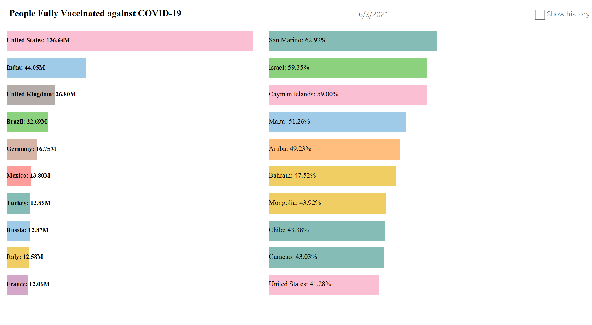

## **COVID-19 Exploratory Analysis and Visualizations**
Exploratory analysis with SQL and visualization of COVID-19 datasets using Tableau desktop.

## **Data Source**
You can download the datasets from [Our World in Data Website](https://ourworldindata.org/covid-deaths)
or from their [github repository](https://github.com/owid/covid-19-data)
